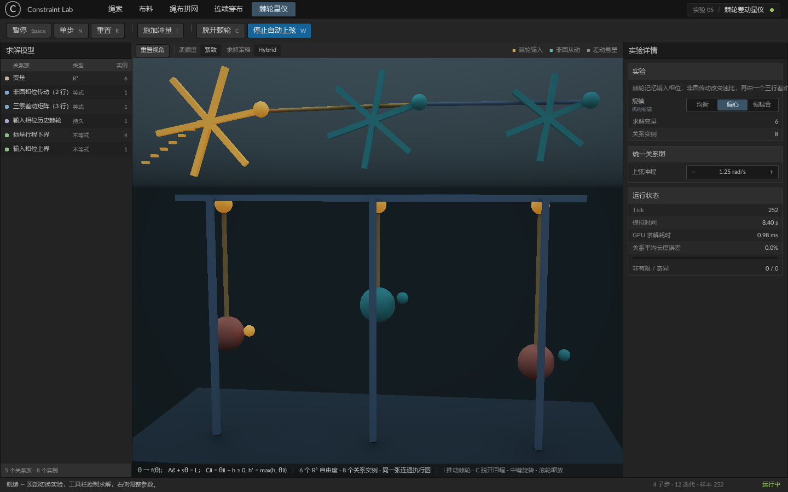

# Constraint Lab — 动态编译执行图的通用 GPU Dynamics

ConstraintLab 展示 Whimsical 的通用 GPU Dynamics 方案：通过 JavaScript 分别声明自由度、对象、两个形式对象之间的数学关系，再用 pair 绑定具体对象，在运行时将模型编译为 GPU 求解执行图，异步执行并消费结果。

## 从数学定义到 GPU 执行

1. **定义模型**：先定义自由度，再显式声明单体 / 集合对象；用 op 编写两个形式对象之间的关系，最后用 `pair` / `pairs` 绑定。关系可以包含多行残差和等式 / 不等式条件，求解乘子由系统管理。
2. **编译执行图**：完整展开集合成员组合及具名自由度，再自动生成 Jacobian，建立数据布局与依赖，安排 Colored / Jacobi / Hybrid 求解阶段。符合容量条件的静态区域会融合到工作组，在共享内存中执行子步与迭代；大型区域与动态端点模型保留全局执行路径。
3. **运行时修改**：数值补丁更新参数、柔顺度、逆度量和启用状态；拓扑变更后重新编译并迁移保留状态。对象与 pair 保留在场景文档中，编译后沿用稳定的自由度和关系集合索引。
4. **提交与消费结果**：异步提交求解、轮询完成状态，按需回读或发布 GPU 状态，获取耗时与数值诊断。

数学接口、生命周期与代码示例见 [GPU Dynamics](../../docs/dynamics.md)，执行区域分析与融合见 [编译器说明](../../docs/dynamics-compiler-optimization.md)。

双击本目录的 `Run.cmd` 启动（需要先构建 `build/bin/Release/Whimsical.exe`）。顶部标签在实验之间切换，六个实验共用同一个求解外壳、同一套展台和同一个面板框架。

界面沿用 [HumanEditor](../HumanEditor) 的编辑器语言：菜单栏放实验标签与当前实验名，工具栏放运行控制和实验自己的动作，左侧「求解模型」列出编译进模型的变量集与各族关系，右侧「实验详情」是规模、参数与遥测，底部状态栏给出最近一条操作反馈。

## 这里展示的差异

XPBD 是数值求解方法，不是一份封闭的物体或关系目录；允许编写自定义求解代码时，通用 XPBD 或其他物理引擎同样可以实现这些最终行为。因此本项目不声称某幅画面是其他引擎绝对无法产生的。

Dynamics 的建模边界是 `DOFs → Objects → Relation → pair`。用户在 JavaScript 中声明一般 XPBD 引擎没有预制的关系，Compiler 自动生成 Jacobian、局部系统、着色、Hybrid 回退和 GPU 执行图。判断标准不是“能不能拼出来”，而是新增关系是否无需修改 C++、引擎或求解器，并且仍然进入统一耦合求解和通用优化流程。

这不是“任意函数都能稳定求解”的承诺：关系需要有可用的局部导数，投影方向要由等式 / 不等式条件明确，断裂、生成、接触集合切换等离散拓扑事件仍需在用户模型中显式表达。

前四个实验展示标准关系的自由组合；第六个实验把多端点多行关系、非线性标量传动和持久状态关系编译到同一张连通图中。

## 实验一：布料

一块布是 32 × 32 个 R3 变量组成的网格，由三族距离关系织成：结构关系按 `d` 连接四邻，剪切关系按 `√2 d` 连接对角，弯曲关系按 `2d` 跨两格。三族共用同一个距离关系定义，只是步长、柔顺度不同；布料的褶皱由这三者的相对刚度决定，没有额外的布料语义。

布料还定义了自己的**接触阻力**关系：位移阻力的权重随着与球面 / 地面的距离升高，靠上去就变大。摩擦不是求解器概念，它由项目用一条 3 行残差、3 个持久状态的关系表达。

- 打开时布料自由下落，覆盖在球面上形成褶皱。
- `C`：抓起 / 放下四角。抓取从角点当前位置开始，随后按提起高度平滑上升，不会瞬移拉扯。
- `W`：横向阵风；面板可切换微风 / 阵风 / 强风。
- 上 / 下方向键或面板的 `− / +`：调整提起高度。
- `I`：给布料一个侧向冲量。
- 16² / 24² / 32²：切换求解网格。

## 实验二：绳索

每条绳子使用 64 个 R3 变量，相邻变量之间是距离关系；球面与地面用不等式条件表示。

- `I`：推一下绳子，观察侧向摆动。
- `C`：松开 / 接回右端，观察绳子滑过球面并落地。
- 方向键：移动固定的右端；面板的 `− / +` 调整端点高度。
- `W`：自动前后摆动右端。
- 1 / 16 / 64 条：同时求解并显示对应数量的独立绳子，按 1 × 1 / 4 × 4 / 8 × 8 网格排列，镜头自动调整。端点、扰动和柔顺度控制作用于全部绳子。

## 实验三：绳布拼接网

16 块独立的小布按 4 × 4 铺开，相邻布块的边缘之间留有空隙，并由三根短绳逐边连接。拼成的整张网最外侧四角再分别接一根长绳，悬挂到方形吊架。

模型用一次 `defineDofs(...)` 定义全部运动节点，再显式声明集合及其成员。每根短绳的两端直接使用相邻布块的边缘自由度，四根角绳也直接终止在四块角布的外角自由度；中间绳节点、所有布块节点和四个固定吊点都在同一个 R3 变量集中。因此没有模拟后粘合、CPU 同步或第二个求解实例。默认模型是一张 704 变量 / 4,136 关系的连通图，包含 72 根短连接绳和 4 根角绳。


- `W`：交替摆动四个吊点，运动经角绳和短绳传遍全部布块。
- `C`：施加侧向风，观察布块和绳网共同摆动。
- 上 / 下方向键或面板的 `− / +`：运行时收紧或放松全部布块间短绳。
- `I`：向整张拼接网施加侧向冲量。
- 2 × 2 / 3 × 3 / 4 × 4：切换布块阵列规模。

## 实验四：连续穿绳布

一根连续绳索从整块布面的左上角出发，反复横穿布面、从侧边露出并折回，最后回到右上角。五条穿入路径交替显示在布面前后，外露绳环把它们连接成一根可以从头追踪到尾的绳。

模型同样用一次 `defineDofs(...)` 定义全部运动节点，再显式声明集合及其成员。绳索进入布面后直接使用整行布面自由度，离开布面时才增加外露绳环节点；两个固定端点同时也是布角和绳端。默认模型是一张 1,056 变量 / 8,131 关系的连通图，其中连续穿绳包含 193 段关系。

- `W`：交替抽动连续穿绳的两端。
- `C`：施加侧向风。
- 上 / 下方向键或面板的 `− / +`：收紧或放松整根穿绳。
- `I`：向连续绳和整块布共同施加侧向冲量。
- 16² / 24² / 32²：切换布面网格规模。

## 实验五：棘轮差动星仪

这个实验不是把三个装置分别模拟后摆在一起。三枚传动轮的角度与三枚悬星的垂直位置属于同一个 R1 变量集；历史棘轮、非圆传动和三索差动关系共享端点，组成一张连通关系图：

- **历史棘轮**：`Cᵣ = θ₀ − h ≥ 0, h′ = max(h, θ₀)`，保存输入轴到达过的最大相位。
- **非圆传动**：两行带 `sin` 项的关系从 `θ₀` 生成变化速比的 `θ₁ / θ₂`。
- **三索差动**：一个三行矩阵关系 `Aℓ + sθ = L` 同时决定三根吊索长度。

每次上弦都会经过完整链路改变三枚悬星的高度；由于非圆相位与差动矩阵共同作用，它们不会等速或同向运动。脱开棘轮后，输入轴在回程力矩与悬星重力下退回，整套机构一起复位。相位列车和三枚载荷各是一个暴露三个具名自由度的单体对象；它们之间的一个 pair 保留原来的六自由度三行数学。Compiler 只看到对象字段、空间、公式、条件与 history。



- `I`：手动推动一次棘轮输入。
- `W`：开启或停止周期自动上弦。
- `C`：脱开 / 扣上棘轮；脱开后观察整套机构回程。
- 上 / 下方向键：调整上弦冲程。
- 均衡 / 偏心 / 强耦合：重编译不同的非线性轮廓与差动系数。

## 实验六：集合粒子

100 个位置自由度组成显式粒子集合，五个平面的法线与偏移自由度组成显式边界集合。用户用 op 编写平方间距和半空间残差，再声明三条绑定：

```js
X.pair(separation, particles, particles, {diameter:0.36}, {
    self:'undirected', includeSelf:false
});
X.pair(containment, particles, walls, {radius:0.18});
X.pair(damping, particles, frame, [], {history:initial, compliance:[0.08,0.08,0.08]});
```

Compiler 分别完整展开为 4,950、500、100 个关系实例。示例没有在用户侧枚举粒子连接，也没有邻域筛选或集合归约；它展示粒子间距及容器条件，不包含不可压缩水的密度模型。`I` 给粒子集合施加一个向上的冲量。

## 通用操作

- `Space`：暂停 / 继续；暂停后 `N` 或「单步」推进一次。
- `R`：恢复当前实验的初始状态。
- 中键拖动：旋转视角；滚轮：缩放；「重置视角」回到实验的默认机位。
- 距离柔顺度：切换柔软 / 适中 / 紧致，作用于结构关系。
- `Hybrid / Jacobi`：切换求解策略并重置。

## 代码结构

- `Content/scripts/lab.js`：外壳。它拥有求解实体、展台、镜头和面板框架，并提供一小组带参数的公共关系（距离、地面半空间、球面外部、位移阻力）与姿态映射（点、线段、四点面片）。
- `Content/scripts/cloth.js`、`rope.js`、`woven.js`、`threaded.js`：四个标准关系组合实验。
- `Content/scripts/clockwork.js`：复合对象之间的多行差动、非线性传动与持久棘轮。
- `Content/scripts/particles.js`：集合与自身、不同集合、集合与单体的高层 pair 绑定。
- 每个实验只拥有自己的数学、道具和面板行；外壳按实验声明的 `sizes / actions / rows / keys / families` 渲染并接线，新增实验不需要改界面。
- `Content/scripts/main.js`：大纲与面板渲染、快捷键与遥测。
- `Content/UI/`：编辑器风格的操作界面、求解耗时和诊断信息。
- `tools/generate_meshes.py`：生成项目自有的 STM1 圆柱 / 球体 / 展台网格和材质。

## 渲染与规模

引擎当前没有布料网格组件（见 [Dynamics 与 ECS](../../docs/dynamics-ecs.md)），因此布面由项目自己的姿态映射表达：每个可视单元是一块薄板，`bindPatch` 用四个角点变量算出中心、法线、切线和被剪切后的实际跨度，输出一个 local 姿态。板片朝向完全由映射表达式决定，引擎不知道它是布。

每次求解推进 1/30 秒，4 子步 × 12 迭代。绳索 64 条为 4,096 变量 / 16,320 关系，布料 32² 为 1,024 变量 / 8,898 关系，绳布拼接网 4 × 4 为 704 变量 / 4,136 关系，连续穿绳布 32² 为 1,056 变量 / 8,131 关系。棘轮差动星仪为 6 个 R1 变量 / 8 个关系实例；它规模较小是为了直接观察跨关系传播，而不是作为吞吐基准。

渲染实例上限 1,024：绳索 64 条用 960 个实例，布料使用至多 676 块薄板，绳布拼接网使用 400 块薄板和 200 段连接绳，连续穿绳布使用 484 块薄板和 193 段穿绳。面板的误差统计由当前实验自己定义，并覆盖它声明的主关系。

## 构建与运行

```powershell
.\third_party\cmake\bin\cmake.exe --build build --config Release --target Whimsical -j 6
.\Projects\ConstraintLab\Run.cmd
```

有限帧截图：`Run.cmd --capture --frames 240`，输出到仓库 `captures/frame.bmp`。加 `--validation` 可启用 Vulkan validation。
