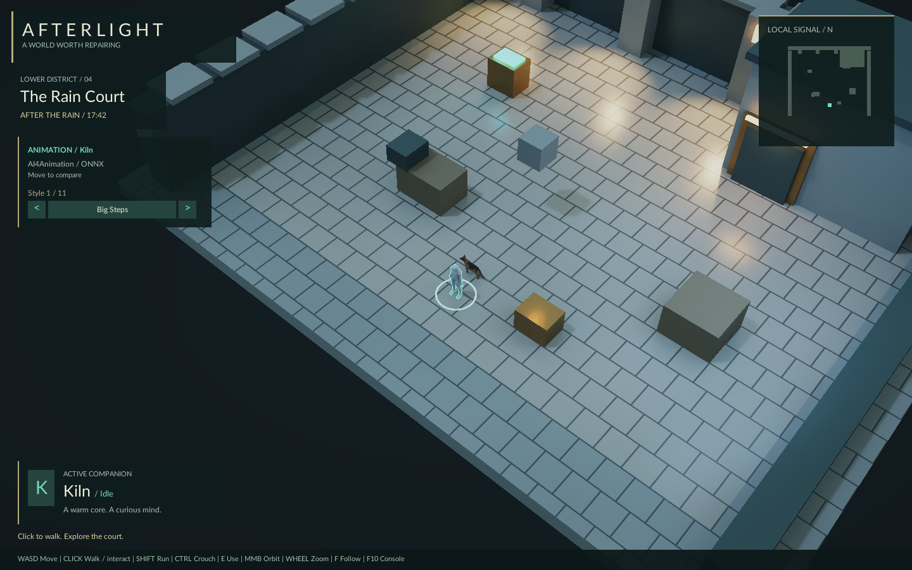
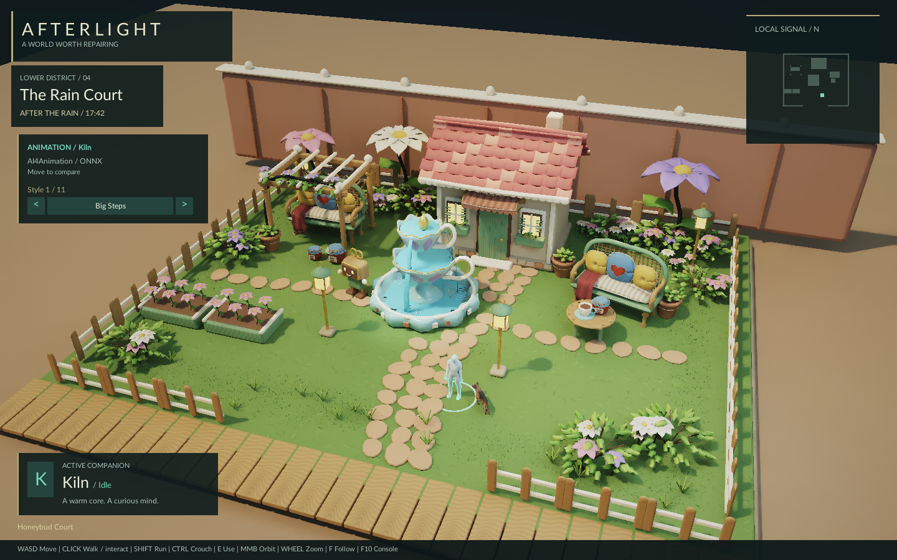
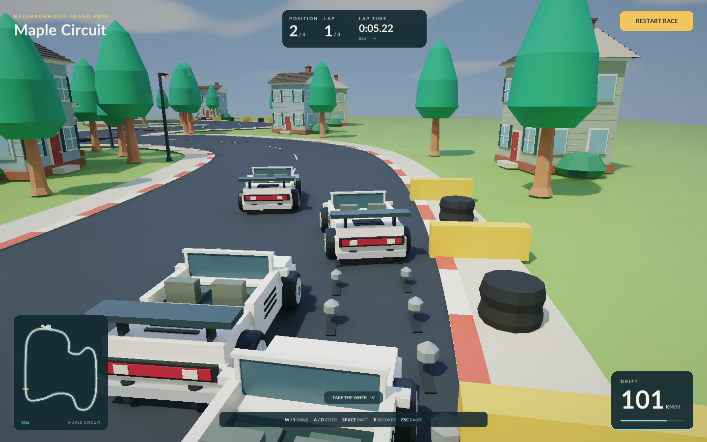
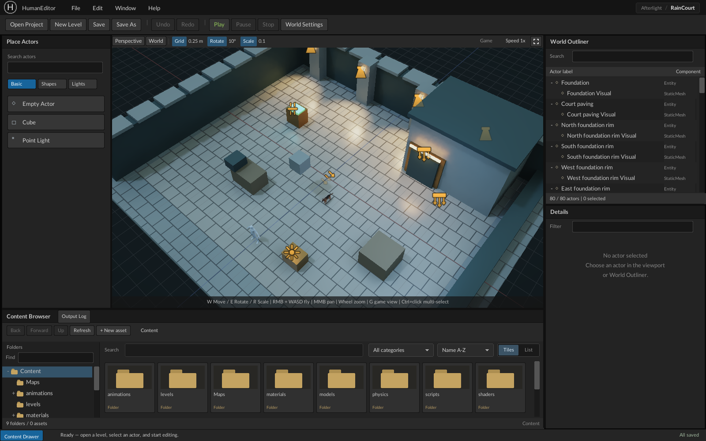
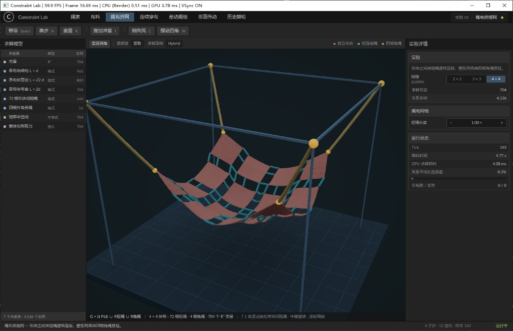

# Whimsical

一个使用 **C++ / JavaScript / Vulkan** 的 Windows 游戏引擎。用 JavaScript 编写玩法和工具，用独立项目组织场景与资产，运行时提供光追渲染、角色动画、场景编辑和 GPU 约束求解。

仓库附带 **5 个可运行项目**：人犬神经网络动画、街机赛车、场景编辑器、通用 GPU Dynamics 和像素拾取示例。可以先运行体验，再从项目脚本开始修改。

[快速开始](#快速开始) · [项目与截图](#项目与截图) · [常用操作](#常用操作) · [引擎开发指南](engine.md)

## 快速开始

### 环境要求

- Windows x64。
- 支持 Vulkan 1.3、ray query 和 acceleration structure 的显卡及驱动；当前渲染路径需要硬件光追支持。
- 从源码构建需要 Visual Studio 2019 的 C++ 桌面开发工具与 Windows SDK，以及 Node.js 22+。

在仓库根目录执行：

```powershell
node tools/bootstrap.mjs
powershell -ExecutionPolicy Bypass -File tools/build.ps1
.\Run.cmd
```

依赖下载到 `third_party/`，无需另外安装 Vulkan SDK。构建完成后生成 `build/bin/Release/Whimsical.exe`；之后可直接双击启动脚本。首次运行会编译着色器，请等待场景出现。当前开发运行方式需要保留源码与项目资源。

### 选择一个项目

以下命令均在仓库根目录执行：

| 想体验什么 | 项目 | 启动方式 |
| --- | --- | --- |
| 人与狗的神经网络驱动动画 | [Afterlight / Rain Court](Projects/Afterlight/README.md) | `.\Run.cmd` |
| 在花园场景中体验同一套神经动画 | [Afterlight / Honeybud Court](Projects/Afterlight/README.md) | `.\RunHoneybud.cmd` |
| 四车竞速与漂移 | [Maple Circuit](Projects/MapleCircuit/README.md) | `.\RunMapleCircuit.cmd` |
| 打开场景、选取和编辑对象 | [HumanEditor](Projects/HumanEditor/README.md) | `.\Projects\HumanEditor\Run.cmd` |
| 从数学关系动态编译 GPU 求解执行图 | [ConstraintLab](Projects/ConstraintLab/README.md) | `.\Projects\ConstraintLab\Run.cmd` |
| 查看实体 ID 输出与异步像素读取示例 | [EntityID](Projects/EntityID/README.md) | 下方命令 |

```powershell
.\build\bin\Release\Whimsical.exe --project Projects/EntityID --width 960 --height 600
```

任意项目都可以通过 `--project` 启动，并指定窗口尺寸：

```powershell
.\build\bin\Release\Whimsical.exe --project Projects/HumanEditor --width 1600 --height 1000
```

## 项目与截图

以下均为仓库项目的实际运行截图，点击可查看原图。

### Afterlight — 人与狗的神经网络驱动动画

人形角色 **Kiln** 和狗 **Ash** 分别使用 AI4Animation 的双足与四足预训练神经网络，通过 ONNX Runtime 在运行时推理动画。移动意图与轨迹驱动骨骼姿态和根运动，角色实际移动后的物理反馈再参与后续求解。

操纵 Kiln 行走、转向和停步，观察 Ash 寻路跟随时的四足动作；还可以切换 Kiln 的 **11 种移动风格**。Rain Court 与 Honeybud Court 是这套神经动画的两个展示场景，分别提供简洁交互庭院和带陶瓷喷泉的暖色花园。

| Rain Court | Honeybud Court |
| --- | --- |
| [](docs/screenshots/afterlight-rain-court.png) | [](docs/screenshots/afterlight-honeybud-court.png) |

**先试试：** 用 WASD 改变 Kiln 的移动方向，停下后观察人和狗的收步；行走时用左侧 ANIMATION 箭头切换风格。中键拖动旋转镜头，滚轮拉近观察动作。

[查看神经动画示例与操作](Projects/Afterlight/README.md) · [动画实现与模型来源](docs/animation.md)

### Maple Circuit — 街区大奖赛

四辆敞篷跑车、三圈比赛。沿街区赛道加速、过弯和漂移，HUD 显示排名、圈时、速度与赛道位置，也可以让 AI 接管驾驶。

[](docs/screenshots/maple-circuit.png)

**先试试：** 点击 START RACE，W / S 加速刹车，A / D 转向，Space 漂移，R 回正，V 切换 AI 驾驶。截图来自项目自带的 DriftPreview 漂移演示地图。

[查看赛车操作与项目说明](Projects/MapleCircuit/README.md)

### HumanEditor — 编辑场景

在视口中选择对象，用移动、旋转和缩放工具调整场景；通过对象树、属性面板和 Content Browser 管理实体与资产。支持撤销重做，以及 Play / Pause / Stop。

[](docs/screenshots/human-editor.png)

**先试试：** 默认打开 Afterlight 的 Rain Court。点击对象后用 W / E / R 切换变换工具，F 聚焦；Open Project 可以选择另一个项目。建议使用至少 1440×900 的窗口。

[查看编辑器操作与保存说明](Projects/HumanEditor/README.md)

### ConstraintLab — 动态编译执行图的通用 GPU Dynamics

通过 JavaScript 定义数学空间、变量和约束关系，在运行时编译成 GPU 求解执行图。编译器自动生成 Jacobian、安排求解顺序，并根据依赖与容量融合执行区域；运行时支持数值参数更新、拓扑变更后的重新编译与状态迁移，以及异步提交和结果读取。

[](docs/screenshots/constraint-lab.png)

当前画面用绳索演示这套流程：距离、球面碰撞、地面碰撞和阻尼都由项目数学表达式定义。可以修改柔顺度、释放端点，或切换规模与求解策略，观察同一通用编译与运行方案下的结果。

**先试试：** 切换 Hybrid / Jacobi 和 1 / 16 / 64 条示例，比较求解效果；I 施加扰动，C 释放端点，Space 暂停，N 单步。数学定义入口是项目的 `Content/scripts/model.js`。

[查看方案与示例操作](Projects/ConstraintLab/README.md) · [数学接口与运行时](docs/dynamics.md) · [执行图编译与优化](docs/dynamics-compiler-optimization.md)

### EntityID — 像素拾取示例

一个用于理解对象拾取的小型示例：将可见实体 ID 写入整数渲染目标，再异步读取像素。示例依次检查前后遮挡、背景和内容保留，结果输出到运行日志。

[](docs/screenshots/entity-id.png)

运行后查看 `EntityID example PASS`。截图暂停在初始化的前后遮挡状态；画面为彩色场景，ID 数据由独立整数渲染目标提供。

[查看示例与 API 说明](Projects/EntityID/README.md)

## 常用操作

各项目的游戏操作以对应说明为准；以下入口由引擎统一提供：

| 操作 | 用途 |
| --- | --- |
| F10 或 ~ | 打开 / 关闭控制台；Esc 关闭 |
| `help` | 查看命令帮助 |
| `r.Hud 0` / `r.Hud 1` | 隐藏 / 显示项目界面 |
| `r.Stats 1` | 显示性能面板 |
| `profileGPU` / `profileCPU` | 采集 GPU / CPU 耗时，报告保存到 `captures/` |
| Alt+F4 | 关闭应用 |

需要截图时，可以运行有限帧并自动退出：

```powershell
.\Run.cmd --frames 120 --capture
```

图像保存到 `captures/frame.bmp`，每次采集会覆盖该文件。更多窗口、地图和渲染选项可通过 `Whimsical.exe --help` 查看。

## 开始修改

项目位于 `Projects/<项目名>/`。`.project` 指定启动地图和脚本，`Content/` 保存场景、模型、材质、UI 与 JavaScript。日常玩法和界面修改可先从项目的 `Content/scripts/` 与 `Content/UI/` 入手，重启项目查看结果。

- [引擎开发指南](engine.md)：目录、架构、渲染流程、实现边界、诊断命令与开发记录。
- [Project / Asset / Scene](docs/projects-assets-scenes.md)：创建和组织项目、虚拟路径、资产与场景保存。
- [JavaScript 宿主与视图](docs/runtime-host.md)：脚本生命周期、场景运行与编辑器视图。
- [UI Core](docs/ui-core.md)：通过项目脚本创建和操作界面。
- [GPU Dynamics](docs/dynamics.md)：定义数学空间、关系与 GPU 求解任务。

当前没有音频系统和 3D 透明混合；各演示场景的模型范围见对应项目说明。更完整的能力边界和第三方依赖说明集中在 [engine.md](engine.md)。
