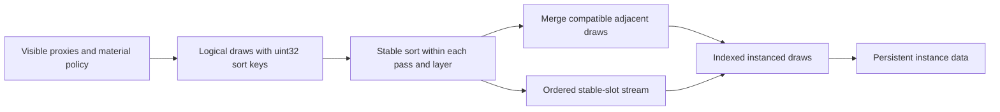

# Raster instancing

The raster interface accepts logical `RasterDraw { slot, sortKey, pipeline }`
items. `sortKey` is an unsigned 32-bit value: lower values execute first, and
equal values retain submission order. Scheduling chooses the key; the raster
backend does not interpret material, distance or application policy.

## Ordering and compatibility

`GpuScene::prepareDraws` sorts a list and scans its drawable neighbours once.
Two neighbours merge when their graphics pipeline and physical index range match.
The pipeline includes shader, output format and fixed-function state. Material
parameters remain per instance, so differing colors or textures do not by
themselves prevent batching. Separately allocated skinned geometry has distinct
index ranges and therefore remains separate.

The sort key is not a batch key. Adjacent compatible draws with different sort
keys can merge because their instance order is retained. An incompatible draw
ends the batch; the backend never moves it to obtain a larger batch. Separate
calls to `prepareDraws` form independent pass/layer boundaries.

The current scheduler uses zero for opaque draws and the inverted unsigned bits
of nonnegative squared camera distance for blended draws. This preserves opaque
submission order followed by back-to-front blended origins. Color and EntityID
receive identical keys and submission order, with their respective pipelines.

## Identity and lifetime

A persistent scene slot still identifies the GPU instance entry, model and
previous model, material binding, EntityID and TLAS custom index. Sorting never
reorders those entries. The frame instead uploads a compact array of slot IDs.

Vertex binding 1 advances once per instance and supplies `inInstanceSlot` at
location 6. `firstInstance` selects a range of that stream; the vertex shader
uses the fetched slot to read persistent instance data and forward identity to
the fragment shader. Both singleton and batched draws use this path.

After the previous frame retires, `beginDraws` resets the stream, `prepareDraws`
appends each list and returns `RasterBatch` ranges, and `uploadDraws` uploads once.
The upload buffer grows geometrically when required. Recording binds geometry
and slot streams and issues `vkCmdDrawIndexed` with each batch's instance count;
it neither allocates nor sorts. RenderGraph declares the slot stream as external
vertex input for every raster pass, alongside the existing geometry inputs.

This follows Vulkan's [instance-rate vertex input and firstInstance semantics](https://docs.vulkan.org/spec/latest/chapters/fxvertex.html)
and [indexed draw contract](https://docs.vulkan.org/refpages/latest/refpages/source/vkCmdDrawIndexed.html).

## Scope and observability

This reduces raster draw submission for adjacent compatible objects. Scene
publication, transform updates, entity storage and TLAS instance counts retain
their existing costs. There is no GPU culling or indirect draw submission here.

Capture reports expose `rasterDrawCalls`, `rasterInstances` and
`largestRasterBatch` for the captured frame across all recorded raster passes.
An object rendered into color and EntityID contributes once to each pass's
instance count. These counters measure actual recorded commands, not candidate
batches that the render graph may discard.
