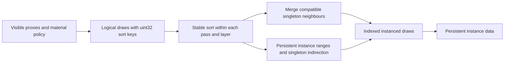

# Raster instancing

The raster interface accepts logical `RasterDraw { slot, sortKey, pipeline }`
items. `sortKey` is an unsigned 32-bit value: lower values execute first, and
equal values retain submission order. Scheduling chooses the key; the raster
backend does not interpret material, distance or application policy.

## Component contract

`RenderComponent::instanceCount` defaults to 1 and must be at least 1.
`instanceTransforms` contains exactly that many local TRS transforms. A singleton
may omit the array, which means identity. A mismatch or zero count is rejected
before changing the component. The same fields are supported in scene JSON;
transform entries use `position`, `rotation` (xyzw quaternion), and `scale`.

```cpp
RenderComponent render{material};
render.instanceCount = 3;
render.instanceTransforms = {{{-2, 0, 0}}, {{0, 0, 0}}, {{2, 0, 0}}};
world.render.add(entity, std::move(render), mesh);
// Replace count and transforms together, without rebinding material or geometry.
world.render.setInstances(entity, 1, {});
```

The static-mesh model matrix is `entityWorld * instanceLocal`. Skinned instances
share the owner's pose and deformed geometry; their model matrix compensates for
the fact that skin vertices are already in owner-world space. All instances share
the component's material, visibility, shadow policy and EntityID.

**One component is always one proxy and one sortable draw, regardless of its
instance count.** A component containing 1,000,000 instances still contributes
one item to sorting and one indexed instanced command per raster pass. Internal
instance order is the authored array order, including for blended materials.
Sorting costs `O(C log C)` for C visible components, not `O(N log N)` for N instances.
This ordering unit is independent of whether adjacent logical draws can merge.



## Ordering and compatibility

`GpuScene::prepareDraws` sorts a list and scans its drawable neighbours once.
Two singleton neighbours merge when their graphics pipeline and physical index range match.
The pipeline includes shader, output format and fixed-function state. Material
parameters remain per instance, so differing colors or textures do not by
themselves prevent batching. Separately allocated skinned geometry has distinct
index ranges and therefore remains separate.

The sort key is not a batch key. Adjacent compatible draws with different sort
keys can merge because their instance order is retained. An incompatible draw
ends the batch; the backend never moves it to obtain a larger batch. Separate
calls to `prepareDraws` form independent pass/layer boundaries.

Explicit groups with `instanceCount > 1` currently form their own batch and end
singleton merging on both sides. They are never expanded into sortable draws.

The current scheduler uses zero for opaque draws and the inverted unsigned bits
of nonnegative squared camera distance for blended draws. This preserves opaque
submission order followed by back-to-front blended origins. Color and EntityID
receive identical keys and submission order, with their respective pipelines.

## Identity and lifetime

A persistent scene slot identifies the whole component. `GpuScene` maps it to a
contiguous range of GPU instances, each holding its model, previous model,
material binding and EntityID. TLAS custom indices address these GPU instances.
Sorting never reorders the ranges or the transform arrays. The range allocator
reuses holes without moving other components. Resizing reinitializes the affected
group's motion history; transform-only changes preserve it and use the existing
delta fast path. Removing a group retires its whole range and TLAS entries.

Published proxies share immutable transform arrays. Repeated snapshots neither
deep-copy the arrays nor upload unchanged transforms.

Vertex binding 1 advances once per instance and supplies `inInstanceSlot` at
location 6. `firstInstance` selects a range of that stream; the vertex shader
uses the fetched slot to read persistent instance data and forward identity to
the fragment shader. Both singleton and batched draws use this path.

The slot stream has a persistent identity prefix (`slot[i] = i`) followed by a
transient suffix for sorted singleton draws. Explicit groups reference the prefix
directly with their GPU range's start and count; preparing them costs O(1) after
sorting, with no per-frame expansion of N instance indices. The identity prefix
is initialized only on buffer growth. Transform data and TLAS storage still scale
with the actual instance count and remain subject to device limits.

After the previous frame retires, `beginDraws` resets the transient suffix,
`prepareDraws` returns `RasterBatch` ranges, and `uploadDraws` uploads the suffix once.
The upload buffer grows geometrically when required. Recording binds geometry
and slot streams and issues `vkCmdDrawIndexed` with each batch's instance count;
it neither allocates nor sorts. RenderGraph declares the slot stream as external
vertex input for every raster pass, alongside the existing geometry inputs.

This follows Vulkan's [instance-rate vertex input and firstInstance semantics](https://docs.vulkan.org/spec/latest/chapters/fxvertex.html)
and [indexed draw contract](https://docs.vulkan.org/refpages/latest/refpages/source/vkCmdDrawIndexed.html).

## Scope and observability

This supports both authored instance groups and dynamic batching of compatible
singleton components. Scheduling scales with components; GPU transform updates
and TLAS work scale with instances. There is no GPU culling or indirect draw
submission here.

Capture reports expose `rasterDrawCalls`, `rasterInstances` and
`largestRasterBatch` for the captured frame across all recorded raster passes.
An object rendered into color and EntityID contributes once to each pass's
instance count. These counters measure actual recorded commands, not candidate
batches that the render graph may discard.
