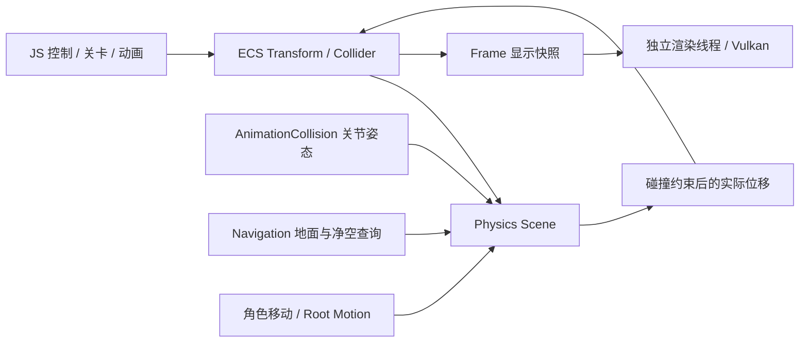

# Physics Scene

原来的碰撞、拾取和 A* 直接遍历实体几何；现已拆为独立的主线程 `PhysicsScene`。ECS 的 Renderable 与 Collider 独立组合；Collider 只持有 PhysicsScene 的 BodyHandle。物理场景自己存储形状、姿态、查询过滤和生命周期，导航与动画碰撞模块不依赖 World、Renderer、Frame、材质或 Vulkan。



## 数据归属

| 位置 | 职责 |
| --- | --- |
| `engine/physics/PhysicsScene.*` | 碰撞体、句柄、AABB、查询、运动学扫掠／滑移 |
| `engine/physics/DynamicAabbTree.*` | CPU BVH 构建、叶节点增量维护、空间候选筛选 |
| `engine/core/World.*` | 实体与场景生命周期 |
| `engine/ecs/TransformSystem.cpp` | 层级传播；同步体姿态及渲染代理 |
| `engine/ecs/MotionSystem.cpp` | 碰撞体能力、刚体移动与 grounded movement |
| `engine/animation/AnimationCollision.*` | 多个关节附属碰撞体，跟随动画的刚体姿态 |
| `engine/navigation/Navigation.*` | 从物理地面和胶囊净空生成可通行数据，A* 和平滑路径 |
| `Projects/Afterlight/Content/physics/profiles.asset` | ground / obstacle / decoration / character 配置 |
| `Projects/Afterlight/Content/animations/locomotion.asset` | 站立／蹲行高度和 locomotion 参数 |
| `engine/debug/PhysicsDebug.h` | 将物理形状转换成值类型线段快照，供 F2 显示 |

物理句柄包含 slot 和 generation，删除后旧句柄失效。World 对外只开放 const 物理查询接口，变更通过所属系统提交，避免不同场景的数据失配。Physics Scene 拒绝跨线程访问；渲染线程只接收 render proxy、地图标记和调试线段的值拷贝，不持有物理指针或句柄。

隐藏模型、换材质、改变视觉偏移不会改变碰撞。禁用对象同时禁用主碰撞体及所有动画附属体；删除会释放全部关联碰撞体。显示快照保留已删除对象的禁用槽位，以维持稳定的运动向量映射。

## 查询与移动

Box 和 Capsule 支持任意刚体旋转；角色查询体为竖直胶囊。提供最近射线命中、胶囊重叠、连续扫掠和滑移。命中包含 owner、句柄、世界位置、法线、距离和扫掠比例。

通用 `ShapeQuery{shape, pose}` 支持任意朝向的 Box / Capsule 重叠，以及同时平移、旋转的连续扫掠。Box–Box 使用 15 个分离轴，Capsule–Box / Capsule–Capsule 复用精确线段距离；旋转扫掠沿最短四元数弧插值，用分离平面上的平移与角运动上界推进，粗筛包围整个旋转轨迹。即使起点、终点都无重叠，中间旋转撞到障碍也会被拦截。

`MotionSystem::moveBody` 使用物体实际主碰撞体，返回接受的位置、旋转、实际位移、阻挡标记和接触列表；不依赖导航、地面、质量或力积分。首次接触保留已接受的旋转，剩余位移沿接触面滑移，最多处理 5 次接触，保留 2 mm 间隙。扫掠最多推进 128 次，达到迭代上限时按当前安全位置报告保守命中；不负责修复出生穿透，也不施加碰撞冲量。加速、转向、抓地和撞击速度响应由项目 JS 消费接触反馈后决定。

旧的 `Engine.move` / `rootMotion` 仍使用竖直胶囊和 grounded controller；通用物体不会被强制套入角色导航。完整根旋转统一存在 `Transform.local.rotation` 与派生的 `Transform.world.rotation` 中，物理体、显示偏移、渲染矩阵、骨骼和关节附属碰撞体都由此派生。

窄相使用线段到 OBB／线段到线段距离。扫掠采用保守推进，最多 64 次迭代，未收敛时保守阻挡；滑移最多处理 5 次接触，并保留 2 mm 间隙。地面相切不阻碍水平位移。没有初始穿透恢复，出生和脚本设置的姿态应保持有效。

粗筛使用主线程拥有的动态 AABB Tree（二叉 BVH）。Raycast 遍历射线相交的树节点，Overlap 遍历查询胶囊包围盒相交的节点，Sweep 使用覆盖整段位移的胶囊包围盒。取得候选后仍检查物理属性和精确 AABB，再进入原有窄相。候选按 body slot 排序，保持射线等距命中、扫掠接触和重叠结果的既有顺序，不随树的旋转或重建改变。

地图加载与运行时统一按组件创建/删除增量维护 BVH，不再为场景实例化额外执行全量重建。独立后端仍提供 `rebuildBroadphase()`，按包围盒中心最长轴递归中位数划分。运行中创建物理体直接插入叶节点；移动、旋转或改变形状只更新相关叶节点，删除和禁用移除叶节点，重新启用以最新包围盒插入。插入按包围盒表面积代价选择位置，沿祖先路径更新包围盒并做高度平衡旋转；不会逐帧全量重建。

树叶包围盒每边扩张 10 cm，物体小幅移动且仍被包含时不重新插入，但 PhysicsScene 的精确包围盒立即更新。物体超出余量或大形状明显缩小时，移除并重新插入原叶节点。批量重建保留叶索引和 BodyHandle，且不改变物理场景 revision；它只改变索引布局。`broadphaseStatistics()` 提供当前叶数、树高和累计重插入／重建次数。

所有启用的物理体都进入树，包括不阻挡的装饰与 Trigger，以保留无过滤场景查询的语义；碰撞属性在候选阶段读取，改属性无需重建。`bodies()` 全量枚举、项目按需查询碰撞体及调试线框生成仍是遍历；本次 BVH 加速的是空间查询。没有引入物理线程、跨线程变更队列或渲染器依赖。

默认查询层为 World=1、Character=2、Trigger=4，支持 mask 和 ignoreOwner。`blocking`、`walkable`、`pickable` 相互独立，触发体可被查询而不阻碍移动。

寻路向物理场景发射地面射线，再用代理的实际半径和身高检查净空。A* 只缓存本次查询的单元通行性，后续查询读取门与障碍的最新状态；抬到头顶的障碍不会仅因 XZ 投影重叠而阻挡。缺少物理地面的区域不可走；点击也不再默认落到无限 Y=0 平面。

当前导航及 grounded controller 面向近似水平的庭院，地面高度差超过 2.5 cm 时拒绝直接通行；支撑采用中心和脚印采样。范围与网格大小读取关卡 JSON。多层导航、自动台阶、坡面、跳跃、攀爬需要后续的导航层／遍历链接和控制器扩展。

## 动画与固定 tick

先执行 `Locomotion.prepare` 提交站立／蹲下请求，再让 Controller 请求路径。胶囊缩放保持脚底位置，扩张会检查头顶净空；低顶下松开 Ctrl 仍保持实际蹲姿和速度，移出后才站起。

手动位移和 `Engine.rootMotion` 共用物理扫掠／滑移，返回实际位移；当前 root motion 受 grounded controller 约束，不能直接越过地面／高度检查。行走 bob 和显示缩放走 `visualPose`，不让物理胶囊上下抖动。

附属碰撞体由“对象根姿态 × 关节相对根姿态 × 附属体局部姿态”驱动，更新后立即可查询，生命周期跟随对象。原生和 JS 接口均已测试；双足与四足角色通过 Animator 提交 FK 姿态。附属体更新不自动生成连续碰撞事件，高速攻击可显式请求 `physicsSweep`。

## JS 接口

向量为 `{x,y,z}`，旋转为单位四元数 `{x,y,z,w}`，默认单位旋转；单位为米。

| API | 行为 |
| --- | --- |
| `Engine.collider(id, description)` | 独立配置 shape、layer、blocking、walkable、pickable |
| `Engine.move(id,dx,dz)` | 物理扫掠／滑移与地面约束，返回实际中心位置 |
| `Engine.moveBody(id,delta,targetRotation?,mask?)` | 按主碰撞体连续移动／旋转并滑移，返回 `{position,rotation,applied,blocked,contacts}`；旋转默认保持当前值，mask 默认全部层 |
| `Engine.rootMotion(id,localDelta,deltaYaw)` | 局部动画位移经过同一物理控制器 |
| `Engine.characterHeight(id,height)` | 保持脚底并检查净空，返回生效高度 |
| `Engine.findPath(id,target)` | 使用角色实际脚底和物理尺寸寻路 |
| `Engine.transform(id,pose)` / `localTransform(id,pose)` | 写世界／局部刚体姿态，并传播关联空间资源 |
| `Engine.renderScale(id,scale)` | 单独修改显示尺寸，不改变 Collider |
| `Engine.transform(id,{position,rotation})` | 瞬移到完整刚体姿态，保持显示尺寸；不做沿途碰撞检测 |
| `Engine.position(id)` | 返回 `{x,y,z,yaw,rotation}`；yaw 是从四元数计算的水平朝向，范围为 −π 到 π |
| `Engine.visualPose(id,offset,scale)` | 纯显示偏移和缩放 |
| `Engine.solid(id,bool)` | 更新物理阻挡属性 |
| `Engine.visible(id,bool)` / `enabled(id,bool)` / `destroy(id)` | 显示、整个对象的启用、生命周期 |
| `Engine.physicsRaycast(origin,direction,distance,mask)` | 最近物理命中或 null |
| `Engine.physicsOverlap(center,radius,height,mask,ignoreOwner)` | 返回物理重叠命中数组 |
| `Engine.physicsSweep(center,radius,height,delta,mask,ignoreOwner)` | 对 blocking 体连续扫掠 |
| `Engine.physicsShapeSweep(query,delta,targetRotation?,filter?)` | Box / Capsule 的连续平移与旋转查询，返回命中或 null；不移动实体 |
| `Engine.physicsShapeOverlap(query,filter?)` | Box / Capsule 在完整姿态下的重叠命中数组 |
| `Engine.physicsRevision()` | 空间数据变更版本 |
| `Engine.physicsBodies(filter?)` | 按通用 QueryFilter 枚举启用体，返回值拷贝 `{owner,slot,generation,layer,min,max,blocking,walkable,pickable}`；min/max 为世界 AABB，不含小地图规则 |
| `Engine.animationJoints(id,poses)` | 提交相对对象根节点的关节刚体姿态 |
| `Engine.animationCollider(id,joint,description)` | 创建附属 box/capsule，默认 Trigger；需先提交关节姿态 |
| `Engine.navigation({min,max,cellSize})` | 地面查询范围与导航网格配置 |

可在关卡脚本中使用：

```javascript
Engine.collider(obstacleId, {
    shape: 'box', halfExtents: {x: 1.2, y: 1, z: .15},
    layer: 1, blocking: true, walkable: false, pickable: true
});
Engine.visible(obstacleId, false); // 模型隐藏，物理障碍仍存在。
Engine.animationJoints(characterId, [{position: {x: 0, y: .2, z: .5}}]);
Engine.animationCollider(characterId, 0, {shape: 'capsule', radius: .15, height: .6});
```

通用查询的 `query` 在同一对象中描述 `shape`、`halfExtents` 或 `radius/height`，以及 `position/rotation`。`filter` 可指定 `mask`、`ignoreOwner`、`blockingOnly`、`walkableOnly`、`pickableOnly`，默认查询全部层上的启用物体。旋转采用单位四元数 `{x,y,z,w}`。

```javascript
Engine.collider(vehicle, {
    shape: 'box', halfExtents: {x: .9, y: .5, z: 2},
    layer: 2, blocking: true, walkable: false, pickable: true
});
var target = {x: 0, y: Math.sin(heading / 2), z: 0, w: Math.cos(heading / 2)};
var result = Engine.moveBody(vehicle, {x: vx * dt, y: 0, z: vz * dt}, target);
// result.rotation 是实际接受的转向；contacts 给出撞击法线与对方 owner。
```

这是已接入 gameplay 的查询与运动学物理后端，具备动态 BVH 粗筛；尚无力／质量／重力积分、刚体堆叠、约束求解、ragdoll 或三角网格碰撞。后续可替换 PhysicsScene 内部后端，保留导航、动画与 gameplay 的查询边界。

`physics_bvh` 测试覆盖 4096 个顺序插入物体的树高和查询裁剪、批量构建、微小移动、远距离移动、缩放、禁用后修改再启用、删除／槽位复用及重建后的叶索引稳定性；随机更新后将空间候选与暴力包围盒查询对照，并将完整物理查询与逐物体独立检测的线性参考结果对照。原有 `physics_scene` 测试继续验证薄墙高速扫掠、滑移、导航、动画碰撞体和生命周期。

`kinematic_shapes_transforms` 验证旋转 Box 高速穿越 1 cm 薄墙时的接触位置、滑移、地面相切转向、任意朝向 Capsule、Box/Capsule 混合查询、仅旋转的中途碰撞、俯仰碰顶、真实 JS 接触反馈，以及四元数显示矩阵、附属碰撞体和场景存盘恢复。

F2 线框：蓝色为地面，金色为障碍，绿色为角色，粉色为触发体。也可运行 `Run.cmd --physics-debug`。线框从物理数据生成，用于核对显示与碰撞是否一致。
