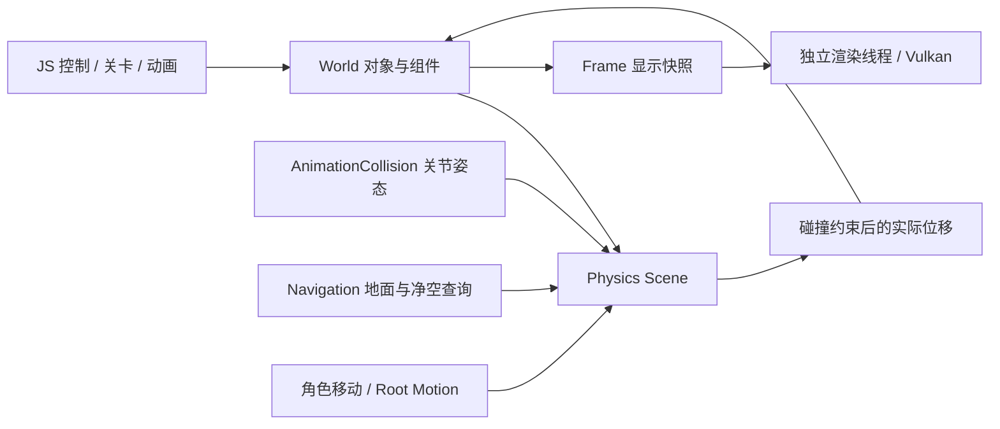

# Physics Scene

原来的碰撞、拾取和 A* 直接遍历实体几何；现已拆为独立的主线程 `PhysicsScene`。`GameObject` 分别持有 `RenderComponent` 和 `BodyHandle`。物理场景自己存储形状、姿态、查询过滤和生命周期，导航与动画碰撞模块不依赖 World、Renderer、Frame、材质或 Vulkan。



## 数据归属

| 位置 | 职责 |
| --- | --- |
| `engine/physics/PhysicsScene.*` | 碰撞体、句柄、AABB、查询、运动学扫掠／滑移 |
| `engine/core/World.*` | 对象生命周期；统一提交物理和显示更新 |
| `engine/animation/AnimationCollision.*` | 多个关节附属碰撞体，跟随动画的刚体姿态 |
| `engine/navigation/Navigation.*` | 从物理地面和胶囊净空生成可通行数据，A* 和平滑路径 |
| `game/assets/physics/profiles.json` | ground / obstacle / decoration / character 配置 |
| `game/assets/animations/locomotion.json` | 站立／蹲行高度和 locomotion 参数 |
| `engine/debug/PhysicsDebug.h` | 将物理形状转换成值类型线段快照，供 F2 显示 |

物理句柄包含 slot 和 generation，删除后旧句柄失效。World 对外只开放 const 物理查询接口，变更通过对象 API 提交，避免不同场景的数据失配。Physics Scene 拒绝跨线程访问；渲染线程只接收 render proxy、地图标记和调试线段的值拷贝，不持有物理指针或句柄。

隐藏模型、换材质、改变视觉偏移不会改变碰撞。禁用对象同时禁用主碰撞体及所有动画附属体；删除会释放全部关联碰撞体。显示快照保留已删除对象的禁用槽位，以维持稳定的运动向量映射。

## 查询与移动

Box 和 Capsule 支持任意刚体旋转；角色查询体为竖直胶囊。提供最近射线命中、胶囊重叠、连续扫掠和滑移。命中包含 owner、句柄、世界位置、法线、距离和扫掠比例。

窄相使用线段到 OBB／线段到线段距离。扫掠采用保守推进，最多 64 次迭代，未收敛时保守阻挡；滑移最多处理 5 次接触，并保留 2 mm 间隙。地面相切不阻碍水平位移。没有初始穿透恢复，出生和脚本设置的姿态应保持有效。

默认查询层为 World=1、Character=2、Trigger=4，支持 mask 和 ignoreOwner。`blocking`、`walkable`、`pickable` 相互独立，触发体可被查询而不阻碍移动。

寻路向物理场景发射地面射线，再用代理的实际半径和身高检查净空。A* 只缓存本次查询的单元通行性，后续查询读取门与障碍的最新状态；抬到头顶的障碍不会仅因 XZ 投影重叠而阻挡。缺少物理地面的区域不可走；点击也不再默认落到无限 Y=0 平面。

当前导航及 grounded controller 面向近似水平的庭院，地面高度差超过 2.5 cm 时拒绝直接通行；支撑采用中心和脚印采样。范围与网格大小读取关卡 JSON。多层导航、自动台阶、坡面、跳跃、攀爬需要后续的导航层／遍历链接和控制器扩展。

## 动画与固定 tick

先执行 `Locomotion.prepare` 提交站立／蹲下请求，再让 Controller 请求路径。胶囊缩放保持脚底位置，扩张会检查头顶净空；低顶下松开 Ctrl 仍保持实际蹲姿和速度，移出后才站起。

手动位移和 `Engine.rootMotion` 共用物理扫掠／滑移，返回实际位移；当前 root motion 受 grounded controller 约束，不能直接越过地面／高度检查。行走 bob 和显示缩放走 `visualPose`，不让物理胶囊上下抖动。

附属碰撞体由“对象根姿态 × 关节相对根姿态 × 附属体局部姿态”驱动，更新后立即可查询，生命周期跟随对象。原生和 JS 接口均已测试；当前角色仍是程序胶囊，尚未载入骨骼动画资源。附属体更新不自动生成连续碰撞事件，高速攻击可显式请求 `physicsSweep`。

## JS 接口

向量为 `{x,y,z}`，旋转为单位四元数 `{x,y,z,w}`，默认单位旋转；单位为米。

| API | 行为 |
| --- | --- |
| `Engine.collider(id, description)` | 独立配置 shape、layer、blocking、walkable、pickable |
| `Engine.move(id,dx,dz)` | 物理扫掠／滑移与地面约束，返回实际中心位置 |
| `Engine.rootMotion(id,localDelta,deltaYaw)` | 局部动画位移经过同一物理控制器 |
| `Engine.characterHeight(id,height)` | 保持脚底并检查净空，返回生效高度 |
| `Engine.findPath(id,target)` | 使用角色实际脚底和物理尺寸寻路 |
| `Engine.pose(id,x,y,z,yaw,renderHeight)` | 更新对象和物理位置／朝向；最后一个参数仅为显示模型的 Y 尺寸 |
| `Engine.visualPose(id,offset,scale)` | 纯显示偏移和缩放 |
| `Engine.solid(id,bool)` | 更新物理阻挡属性 |
| `Engine.visible(id,bool)` / `enabled(id,bool)` / `destroy(id)` | 显示、整个对象的启用、生命周期 |
| `Engine.physicsRaycast(origin,direction,distance,mask)` | 最近物理命中或 null |
| `Engine.physicsOverlap(center,radius,height,mask,ignoreOwner)` | 返回物理重叠命中数组 |
| `Engine.physicsSweep(center,radius,height,delta,mask,ignoreOwner)` | 对 blocking 体连续扫掠 |
| `Engine.physicsRevision()` | 空间数据变更版本 |
| `Engine.animationJoints(id,poses)` | 提交相对对象根节点的关节刚体姿态 |
| `Engine.animationCollider(id,joint,description)` | 创建附属 box/capsule，默认 Trigger；需先提交关节姿态 |
| `Engine.navigation({min,max,cellSize})` | 地面查询范围与导航网格配置 |

可在关卡脚本中使用：

```javascript
Engine.collider(obstacleId, {
    shape: 'box', halfExtents: {x: 1.2, y: 1, z: .15},
    layer: 1, blocking: true, walkable: false, pickable: true
});
Engine.visible(obstacleId, false); // 模型隐藏，物理障碍仍存在。
Engine.animationJoints(characterId, [{position: {x: 0, y: .2, z: .5}}]);
Engine.animationCollider(characterId, 0, {shape: 'capsule', radius: .15, height: .6});
```

这是已接入 gameplay 的查询与运动学物理后端。粗筛当前为缓存 AABB 的线性遍历；尚无力／质量／重力积分、刚体堆叠、约束求解、ragdoll、三角网格碰撞或 BVH。后续可替换 PhysicsScene 内部后端，保留导航、动画与 gameplay 的查询边界。

F2 线框：蓝色为地面，金色为障碍，绿色为角色，粉色为触发体。也可运行 `Run.cmd --physics-debug`。线框从物理数据生成，用于核对显示与碰撞是否一致。
