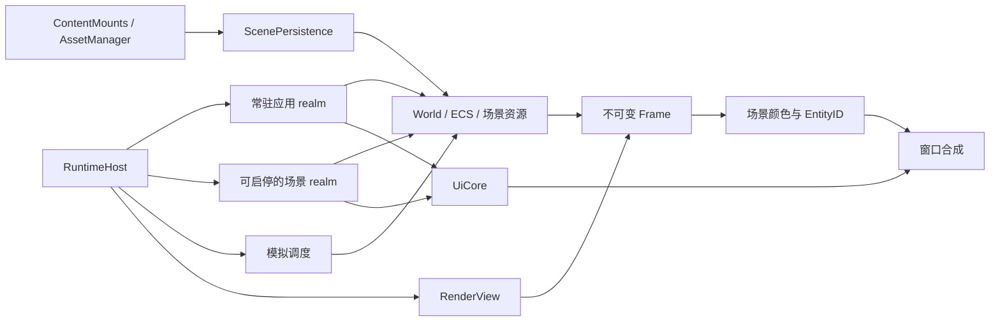

# 应用宿主、场景与视图

Content 是资产来源，场景是这些资产的一次实例化，脚本 realm 是代码的运行环境，视图是对场景的一次观察。这四者的生命周期独立。打开一个 Content 的地图不等于启动它的脚本，也不要求调用方脚本属于该 Content。

## 所有权



- `ContentMounts` / `AssetManager` 沿用来源隔离：加载依赖和保存资产时 `/Game` 属于资产自身的 Content，运行时 AssetRef 保留来源身份。
- `ScenePersistence` 只负责验证、实例化、捕获和保存。它不创建 JS heap，不执行地图脚本，不关闭 UI。`SceneResourceDescription` 是 Map 与运行时资源编辑共用的描述契约，资源查询/修改不要求序列化实体。
- `ScriptRuntime` 只执行一个来源固定的程序及回调。`tick` 不推进 World，不处理切图；UI 回调也进入该 realm 自己的 Content scope。
- `RuntimeHost` 是组合入口：管理常驻应用 realm、可替换的场景 realm、场景切换和模拟推进。现有游戏的启动和切图仍由它组合起来完成。
- `RenderView` 属于宿主。观察相机覆盖和窗口矩形不写进地图。默认跟随地图相机并占满窗口。

第一版宿主呈现一个活动 World、一个视图。这些边界没有引入多 World 流送、多视图调度或编辑器 UI。界面、操作历史和编辑工具由应用项目实现。

## Project 启动策略

`.project` 新增两个可选字段，信封版本仍为 1：

| 字段 | 默认 | 含义 |
| --- | --- | --- |
| `hostScripts` | `[]` | 在项目 Content 中运行的常驻应用脚本，不随地图切换销毁 |
| `startupMode` | `"run"` | `run` 装载并运行；`load` 只装载场景数据 |

已有 `scripts` 仍为场景程序的公共脚本，与地图脚本组成一个 realm；同源公共脚本先加载，再加载地图脚本，最后调用 `initialize()`。没有 Map 的项目仍可用 `scripts` 创建运行时场景。旧项目不需要迁移配置。

`hostScripts` 在启动场景准备完成后执行。它拥有自己的 `initialize`、`fixedUpdate(dt,input)`、`updateUI(dt)`，并可声明 `sceneChanged()`，在后续场景替换完成时重建临时工具对象。两个 realm 的全局变量互不共享。

原生入口：

```cpp
World world;
RuntimeHost host(world, assets, &ui);
host.initialize(project);
host.tick(realDt, input, simulationDt);
auto frame = world.snapshot(input, tick, host.simulationTime(), debugView, physicsDebug, &host.view);
```

`ScriptRuntime::start(origin, scriptRefs)` 是底层的一次性程序启动接口。需要换程序时创建新 realm；单独调用它的 `tick` 只执行 JS。

## 场景操作

```js
Engine.content.mount('/Target', 'D:/AnotherProject/Content');
Engine.scene.load('/Target/Maps/Main');
// 加载请求在 JS 调用返回后的宿主边界执行；本回调中仍是原场景。
// 完成后常驻 realm 的 sceneChanged() 可以重新取得实体与 RT 句柄。
```

| API | 行为 |
| --- | --- |
| `Engine.scene.load(pathOrRef)` | 替换场景数据，停止场景程序与模拟，保留常驻 realm/UI |
| `Engine.scene.info()` | 当前 `{source}`，尚未绑定 Map 时 source 为 null |
| `Engine.scene.capture()` | 返回 `{source, document}`，包含可持久化的场景描述和带来源的引用 |
| `Engine.scene.restore(snapshot)` | 用同一个 staged loader 恢复内存描述，不执行脚本 |
| `Engine.scene.save(pathOrRef, name)` | 同步保存，沿用目标 Content 的依赖闭合与原子文件替换规则 |
| `Engine.scene.resources()` | 查询当前材质表、相机、导航、脚本、玩家、命名引用和场景数据 |
| `Engine.scene.resources(patch)` | 验证并替换指定资源字段；未指定字段保留，实体保持原句柄 |
| `Engine.scene.addMaterial(definitionOrAsset, persistent=true)` | 添加完整 MaterialDefinition 或 Material 资产，返回运行时材质索引 |

`loadScene(path)` 保留为游戏导航入口，等价于数据装载后启动场景程序。跨 Content 导航不会把原项目的公共脚本带入目标 realm。同源时自动使用配置的 Project 公共脚本；跨源场景如需公共脚本，应使用数据装载后显式 `simulation.play({scripts:[...]})`。

加载、恢复、Play、Pause 和 Stop 都排队到保护调用结束后执行，不在事件回调中销毁正在执行的 heap。启动新程序时再次产生的请求留给后续边界。原生 `loadScene/openScene/restoreScene` 的脚本初始化请求也不会递归执行。

依赖准备失败保留原 World 和两个 realm。场景交换后的脚本初始化或通知失败已经跨过提交点，会向调用者报告，不伪装为回滚成功。

capture 返回的是当前挂载会话中的描述，适合操作历史和运行前恢复；它不是跨卸载/重挂仍有效的存档。磁盘持久化通过 `scene.save` 或 `content.save` 完成。

## 模拟生命周期

```js
Engine.simulation.play();
// 或显式指定目标来源的公共脚本，随后自动追加地图脚本：
// Engine.simulation.play({scripts: ['/Target/scripts/bootstrap']});
Engine.simulation.pause(true);
Engine.simulation.pause(false);
Engine.simulation.stop();
```

`play` 在启动目标程序前捕获创作场景；`stop` 通过场景恢复入口恢复这份描述，退出目标 realm 并关闭其 UI，宿主的 UI、相机覆盖与 JS 状态保持存在。已经运行时再次 Play 会报错；Pause 保留场景 realm 和当前模拟状态。`Engine.simulation.state()` 返回 `{running, paused, time}`，其中 time 是场景模拟时钟。

没有 Play 检查点的普通游戏程序执行 Stop 时，停止程序并保留当前场景。Play 检查点不保存 JS 闭包、动画求解历史或 GPU 内容；恢复重新实例化场景，因此旧 Entity 和 RT 句柄失效。

宿主 `fixedUpdate` 使用真实时间、窗口坐标；场景 `fixedUpdate` 使用模拟时间、视口内坐标及视口宽高。暂停和全局时间缩放不停止宿主回调。场景 `World::update` 只由宿主在模拟启用且时间步长大于零时执行一次；同一个时钟提供 Frame 的场景时间，暂停时 shader 时间也保持不变，装载/恢复和 Play 重置该时钟。

## 创作数据与临时对象

```js
var output = Engine.create({
    name: 'ID output', persistent: false,
    components: {drawEntityID: {target: Engine.asset('/Game/Picking')}}
});
```

`persistent:false` 是实体生命周期元数据，默认 true。临时实体继续参与 ECS、渲染和查询，其 Transform 子树继承“不保存”；不会把该属性作为 Map 的新组件写入磁盘。`Engine.persistent(entity,bool)` 修改本地标记。

capture 在解析资产引用前排除临时实体，因此目标地图不会依赖宿主的 ID RT。临时材质通过 `scene.addMaterial(value,false)` 声明；保存时排除并重排剩余材质索引，创作实体的材质引用同步重映射。创作实体引用临时材质、玩家或命名引用指向被排除的实体时，保存明确失败。

完整场景替换会移除临时对象，宿主在 `sceneChanged()` 中重建。临时对象也不进入 Play 检查点。保存不会修改它们当前的运行时索引或身份。

RT 资源仍属于 World。场景替换取消旧票据，但常驻 realm 可继续 poll 得到 `invalidated` 或主动 cancel；scene realm 退出时释放自己尚未消费的票据，避免旧程序占用请求名额。

## ECS 查询与属性编辑

| API | 行为 |
| --- | --- |
| `Engine.entity(entity)` | 持久 ID、名称、本地/有效启用、本地/有效持久化状态、创作组件描述及派生组件名称 |
| `Engine.rename(entity,name)` | 修改显示名，持久 ID 不变 |
| `Engine.findEntity(persistentId)` | 在当前 World 中找运行时 Entity；不存在为 0 |
| `Engine.components(entity)` | `{authored, derived}`；不把 solver 派生的 JointPose 当成可保存的创作数据 |
| `Engine.componentTypes(entity?)` | 从 ComponentCatalog 列出名称、依赖及移除策略、派生所有权；提供实体时附加运行时条件依赖 |

现有 `create/addComponents/component/setComponent/removeComponent/parent/destroy` 不变。枚举直接来自组件契约，不再维护第二份引擎组件名单。描述中的值遵循已有 Map schema；控件样式、字段分组、单位显示和操作历史是项目行为，当前未加入自动字段控件 schema。

资源查询使用运行时材质索引空间，包括临时材质；capture 使用持久化索引空间。资源 patch 先完成描述、引用及材质准备，再替换 live table；不会重新实例化实体、物理或动画后端。

## 独立视图与 ID 图

```js
Engine.view.set({
    rectangle: {x: 280, y: 100, width: 960, height: 640},
    camera: {target:[0,0,0], yaw:0.7, pitch:0.5, distance:15, fov:0.62}
});
Engine.view.set({camera:null}); // 恢复跟随场景相机
Engine.view.reset();           // 同时恢复全窗口布局
```

`view.get()` 返回请求矩形、有效相机和 `cameraOverride`。矩形为窗口像素坐标，全零表示全窗口；窗口变化时按实际窗口裁切。场景的 G-buffer、光照和 NRD 使用视图尺寸，UI 保持窗口尺寸，最后把场景颜色放入窗口矩形并绘制 UI。视图尺寸改变会重建对应时域资源并重置历史。

DrawEntityID 使用同一帧的视图相机和投影。`width:0,height:0` 的 RT 跟随视图尺寸；固定尺寸 RT 覆盖同一个归一化视野。拾取保持现有整数输出和异步 readback 路径：

```js
var pixel = Engine.view.pixel(mouseX, mouseY, windowWidth, windowHeight, rtWidth, rtHeight);
if (pixel) ticket = Engine.readPixels(rt, {x:pixel.x, y:pixel.y, width:1, height:1});
```

`pixel` 在视口外返回 null，省略目标尺寸时使用裁切后的视图尺寸；原点为左上角。结果的 `rtVersion/sourceTick/renderFrame` 仍代表实际生成图像的帧，调用方按既有票据契约处理尺寸变化与场景失效。

## 验证入口

`runtime_host_contracts` 生成两份互相独立的 Content，验证常驻 UI、跨来源场景编辑与保存、Play/Pause/Stop、组件查询、临时子树、相机覆盖和输入坐标。测试目录只在 build 下生成。

运行 `runtime_host_tests.exe` 后，`build/runtime-host-fixture.txt` 给出可运行的临时宿主项目。用现有引擎启动它可验证真实 GPU 的偏移视图、EntityID 中心像素和视图尺寸变化；成功输出 `RuntimeHost GPU PASS`。它是框架测试夹具，不是编辑器项目。

### 2026-09-08 验证记录

- Release 构建通过，最终构建日志无编译警告或错误。
- 13 项相关 CTest 通过：宿主契约、RenderTarget、光源、ECS、RenderGraph、Shader、UI、Content、场景持久化、玩法、动画、跟随与动画属性。
- 临时宿主的真实 GPU 验证运行 90 帧，确认跨 Content 场景、常驻 UI、偏移视口、ID 拾取及视口尺寸变化，validation errors=0。
- 原有 Rain Court smoke 运行 160 帧，覆盖移动、镜头、窗口 resize、最小化恢复、取消移动和地图重载，validation errors=0。
- 图像已检查。截图与报告位于 `captures/runtime-host/`，原项目兼容性结果位于其 `compatibility/` 子目录。示例项目 Content 未修改。
